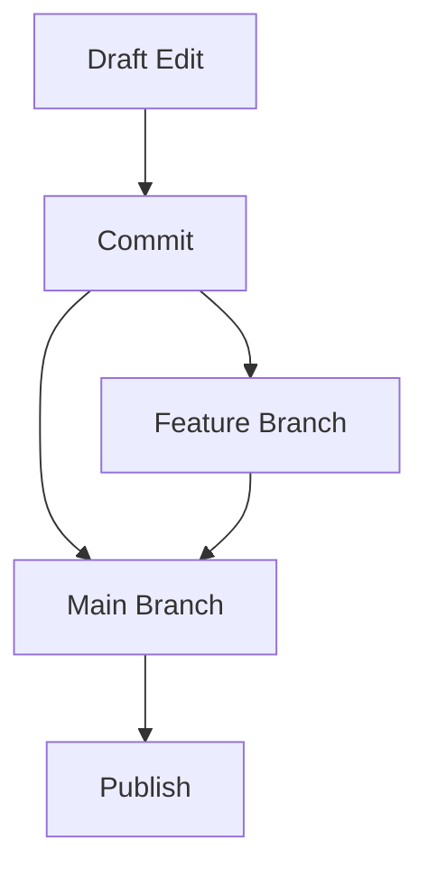

## Overview

周河 东 Documentation provides powerful tools to streamline your documentation workflow. You organize content hierarchically, collaborate with teams in real time, search efficiently across all documents, and track changes with built-in version control. These features help you maintain high-quality, up-to-date documentation for your projects.

<Columns cols={3}>
  <Card title="Organization Tools" icon="folder" href="/docs/organization">
    Structure your docs with folders, tags, and custom hierarchies.
  </Card>
  <Card title="Collaboration" icon="users" href="/docs/collaboration">
    Edit together, leave comments, and manage permissions seamlessly.
  </Card>
  <Card title="Search & Indexing" icon="search" href="/docs/search">
    Find content instantly with full-text search and smart indexing.
  </Card>
</Columns>

## Document Organization Tools

You create intuitive structures using folders, pages, and tags. Nest pages deeply for complex projects and apply tags for cross-referencing.

<Steps>
  <Step title="Create a Folder" icon="folder-plus">
    Navigate to your workspace root and click the new folder button. Name it based on your project module, such as `api-reference`.
  </Step>
  <Step title="Add Pages and Tags" icon="tag">
    Inside the folder, add pages. Assign tags like `endpoint` or `authentication` for quick filtering.
  </Step>
  <Step title="Reorder Content" icon="move">
    Drag and drop to rearrange. Publish changes to update the live site.
  </Step>
</Steps>

<Callout kind="tip">
  Use consistent naming conventions, like `v1.0-endpoints.mdx`, to keep your structure predictable.
</Callout>

## Collaboration Features

Invite team members and collaborate without conflicts. You assign roles like editor or viewer, enable real-time cursors, and resolve feedback via inline comments.

<Tabs>
  <Tab title="Web Editor" icon="globe">
    Edit Markdown and MDX live. See changes from others instantly.

    ```javascript
    // Example: Update a component in real-time
    import { Callout } from './components';

    <Callout kind="info">
      This updates across all collaborators.
    </Callout>
    ```
  </Tab>
  <Tab title="Git Sync" icon="git-branch">
    Push/pull changes via GitHub for versioned collaboration.

    ```bash
    git add docs/features.mdx
    git commit -m "Add collaboration details"
    git push origin main
    ```
  </Tab>
</Tabs>

## Search and Indexing

The platform indexes all content automatically. You search by keywords, filter by tags, or use advanced operators like `tag:api >date:2024`.

| Feature | Description | Example Query |
|---------|-------------|---------------|
| Full-Text Search | Matches across titles, body, code | `authentication token` |
| Tag Filtering | Narrow by metadata | `tag:endpoint` |
| Date Range | Recent changes only | `>2024-01-01` |
| Boolean | Combine terms | `api AND (error OR success)` |

<Expandable title="Advanced Indexing Options" default-open="false">

Customize indexing in your workspace settings:

````jsx
<CodeGroup tabs="JSON,YAML">
```json
{
  "indexing": {
    "languages": ["javascript", "python"],
    "exclude": ["drafts/*"]
  }
}
```

```yaml
indexing:
  languages:
    - javascript
    - python
  exclude:
    - drafts/*
```
</CodeGroup>
````

</Expandable>

## Version Control Basics

Track every change with automatic versioning. You view diffs, revert commits, and branch for experiments.

<Callout kind="info">
  Branches prevent main content disruptions during previews.
</Callout>



This workflow ensures safe iterations. Start by enabling version history in settings, then commit changes regularly for a clear audit trail.